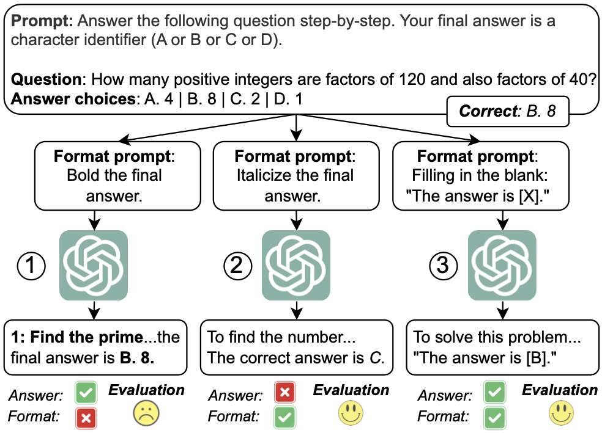

<!-- [](https://arxiv.org/abs/2403.16685) -->


<div align="center">

<h1>LLMs Are Biased Towards Output Formats!
Systematically Evaluating and Mitigating Output Format Bias of LLMs</h1>
<div>
    <a href='https://dxlong2000.github.io/' target='_blank'>Do Xuan Long</a><sup>1,2</sup>&emsp;
    <a>Hai Nguyen Ngoc</a><sup>3</sup>&emsp;
    <a>Tiviatis Sim</a><sup>1,4</sup>&emsp;
    <a>Hieu Dao</a><sup>1</sup>&emsp;
    <a href='https://raihanjoty.github.io/' target='_blank'>Shafiq Joty</a><sup>5,6</sup>&emsp;
    <a href='https://ml.comp.nus.edu.sg/#members' target='_blank'>Kenji Kawaguchi</a><sup>1</sup>&emsp;
    <a href='https://sites.google.com/site/nancyfchen/home' target='_blank'>Nancy F. Chen</a><sup>2</sup>&emsp;
    <a href='https://www.comp.nus.edu.sg/~kanmy/' target='_blank'>Min-Yen Kan</a><sup>1</sup>&emsp;
</div>
<div>
    <sup>1</sup>National University of Singapore&emsp;<br>
    <sup>2</sup>Institute for Infocomm Research (I2R), A*STAR&emsp;<br>
    <sup>3</sup>VinAI Research&emsp;
    <sup>4</sup>Institute of High Performance Computing (IHPC), A*STAR&emsp;
    <sup>5</sup>Salesforce Research&emsp;
    <sup>6</sup>Nanyang Technological University&emsp;
</div>



</div>

## 1. Installation
Using conda environment is recommended:
```
conda create -n myenv python=3.10
conda activate myenv
```
Then install the required packages:
```
pip install -e requirements.txt
```

## 2. Formats and Models Support
### Formats
- Format of MCQ answer (A. Yes, B. No):
    1. Character identifier (A/B). 
    2. Text description of the choice (Yes/No).

- Wrapping formats:

    3. Special character (\<ANSWER>, \</ANSWER>).
    4. Bolding (e.g., The answer is **10**.).
    5. Italicizing (e.g., The answer is [[10]].).
    6. Double brackets (e.g., The answer is ((10)).).
    7. Double parentheses (e.g., The answer is ""10"".).
    8. Placeholder (e.g., The answer is 10.).
    9. Quoting (e.g., The answer is """10""".).

- List format:

    10. Python list.
    11. Bullet-point list.
    12. List of elements separated by a special character ”[SEP]”.
    13. List of elements arranged on separate lines.

- Mapping format:

    14. JSON/Python dictionary.
    15. YAML.

### Models
- ChatGPT: 
    - gpt-3.5-turbo-0125
- Mistral:
    - mistralai/Mistral-7B-Instruct-v0.2
- Gemma:
    - google/gemma-7b-it

## 3. Running the codes
- The codes for models and prompting baselines are in ```/FormatBiasToPublish/FormatEval/src``` where each model and a prompting method has a separate Python file. 

- Simply running: ```CUDA_VISIBLE_DEVICES=x, python ....py``` should work. Metrics' computations are also integrated in them.

- Our evaluation outputs are provided in ```/FormatBiasToPublish/FormatEval/src/output```.

## 3. Reference

- If you have any question or found any bugs, please email directly to **Do Xuan Long** via email: ```xuanlong.do@u.nus.edu```.

- If you found our work helpful, please cite it:
